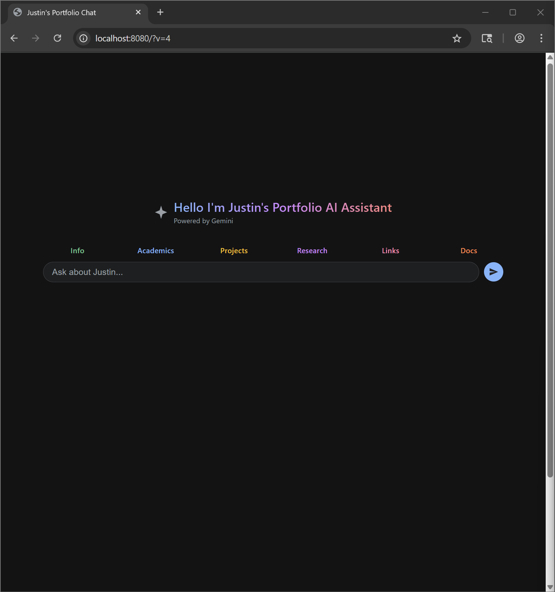

# Justin's Portfolio AI Assistant

## Introduction

An AI-powered interactive portfolio where visitors chat with a Gemini-powered assistant to learn about Justin Stutler's skills, experience, projects, and research. Rather than static pages, the interface provides a conversational way to explore everything you'd find in a traditional portfolio — and more.

**Live Demo:** <https://justinstutlerai.netlify.app/>

## Screenshot

## What's New

**Latest Update — UI Redesign & Overhaul:**
The interface has been completely redesigned with a modern dark theme, streamlined navigation tabs (Info, Academics, Projects, Research, Links, Docs), and a cleaner chat experience.

**Upcoming:**
- Latest project integrations (AI interface, song genre from album art, and more)
- Continued interface improvements and user experience refinements

## Features

* **AI-Powered Chat:** Ask anything about Justin's background, skills, projects, or education. The Gemini-powered assistant responds with context-aware answers.
* **Navigation Tabs:**
    * **Info** — Personal background and summary
    * **Academics** — Courses, GRE scores, and academic history
    * **Projects** — Technical project showcases and write-ups
    * **Research** — Research papers and publications
    * **Links** — External profiles and resources
    * **Docs** — Resume, statement of purpose, and other documents
* **Conversational Interface:** Natural language chat for an engaging way to learn about a candidate.
* **Responsive Design:** Works across desktop and mobile devices.

## Technologies Used

* **LLM:** Google Gemini (gemini-2.5-flash-lite)
* **Frontend:** HTML, CSS, vanilla JavaScript (ES6 modules)
* **Backend:** Python Flask
* **API Integration:** Gemini API (two-stage context selection + answer generation)
* **Deployment:** Netlify (frontend), Render (backend)

## How It Works

1. User types a question or selects a navigation tab.
2. The query is sent to the backend, which runs a two-stage Gemini pipeline:
   - **Context selection** — identifies which content chunks are relevant
   - **Answer generation** — produces a response constrained to the selected context
3. The response is rendered in the chat interface with markdown formatting.

## Acknowledgements

* Google for the Gemini API.
