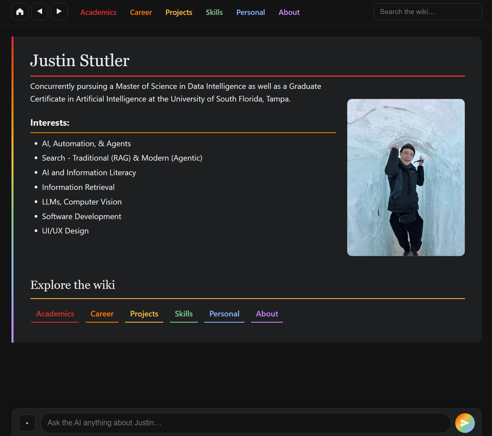

# Justin's Portfolio AI Assistant

## About

This is my twist on a porfolio website, as it is styled as an AI chatbot. You can ask it questions about my background, projects, coursework, or anything you'd normally look for in a resume. It pulls from my actual resume content and responds conversationally using Gemini.

## Purpose

I wanted to enhance my porfolio website to be more engaging than my previous one, and I also wanted to learn more about integrating AI into web applications. 

**Live Demo:** https://justinstutlerai.netlify.app/

## Preview

## Features

### Chips: Quick Queries

Click on a chip to send a Quick Query, common queries a user may have, which are displayed as chips and organized by category and color.

#### 🟢 Info 
- **About Justin**: Learn more about me
- **How This Works**: Learn more about the website
- **Photo Gallery**: View some photos of me

#### 🔵 Academics
- **GRE Scores**: View my GRE scores
- **About a Class**: Learn more about a class I took during my undergraduate studies - graduate studies coming soon

#### 🟡 Projects
- **AI Interface**: View the AI interface project - coming soon
- **Housing Prices**: View the housing prices project
- **Facial Recognition**: View the facial recognition project

#### 🟣 Research
- **Song Genre from Album Art**: View the song genre from album art project - coming soon
- **Robot Localization**: View the robot localization project
- **Uninformed & Informed Search**: View the uninformed & informed search project

#### 🩷 Links
- **GitHub**: Navigate to my GitHub profile

#### 🟠 Docs
- **Resume**: View my resume
- **Statement of Purpose**: View my statement of purpose

### Chat Queries

The user can freely ask questions about me, my education, projects, work experience, or any other questions they have and receive a catered response if the information is available.
AI and RAG are used to retrieve information about me and respond accordingly.

## How It Works

The Quick Query Chips are hard-coded to give a preset response to handle common queries.

The Chat Queries are sent to an llm (Currently using Google's best free model: 2.5 Flash). In my first implementation of RAG, I received poor results, so I changed the setup and received success. The first llm call is used to determine which group of context is relevant to the query. Then, the relevant context is sent to the second llm call that uses it to generate a response that is rendered to the frontend chat ui. This double llm call technique made gemini 1.5 provide acceptable responses that were grounded in the context provided. Now that Google has improved the baseline free model, this technique may not be necessary. In the future, I plan to investigate RAG techniques and see if I can improve the responses further.

Render deploys the backend, and Netlify deploys the frontend. The free aspect of the service is used, but this leads to a 1 minute warm up period for the backend if it has not been used recently. This means the user must wait at least a minute for their first chat query to render which is not ideal, but it is a fair tradeoff.

## Tech Stack

This project utilizes a tech stack that I frequently use for personal projects:

* **Python, Flask** for the backend API server
* **JavaScript (ES6), HTML, CSS** for the frontend (no frameworks, vanilla JS modules)
* **Google Gemini API** for the LLM powering the chatbot
* **RESTful API** design connecting the frontend and backend
* **Git** for version control
* **Netlify** for frontend deployment, **Render** for backend deployment

## What's New

**Latest: UI Redesign**
Rebuilt the entire interface with a dark theme, navigation tabs, and a cleaner chat experience. Much more intuitive to browse through different sections now.

**Coming Up**
* Integrating the latest projects (AI interface, song genre from album art, and more)
* Continued interface and UX improvements
* Improving RAG (retrieval augmented generation) for better context selection and more accurate responses

## Built With
claude, gemini, my own brain, patience, curiosity, and iteration